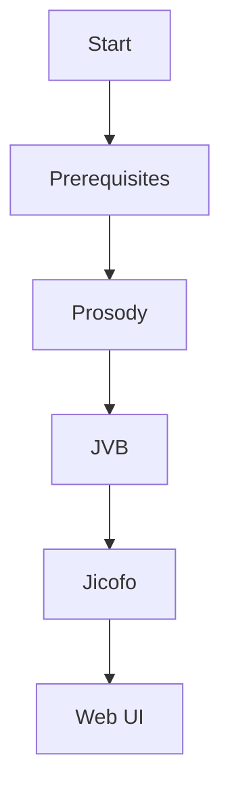

# Installation Flow

!!! warning
    Always run the installer as **root**.

```bash
sudo ./jitsi-master.sh
```

## Menu Flow
```text
1) Prerequisites
2) Prosody
3) JVB
4) Jicofo
5) Web UI
```


```mermaid
flowchart TD
    A[Start] --> B[Prerequisites]
    B --> C[Prosody]
    C --> D[JVB]
    D --> E[Jicofo]
    E --> F[Web UI]
```